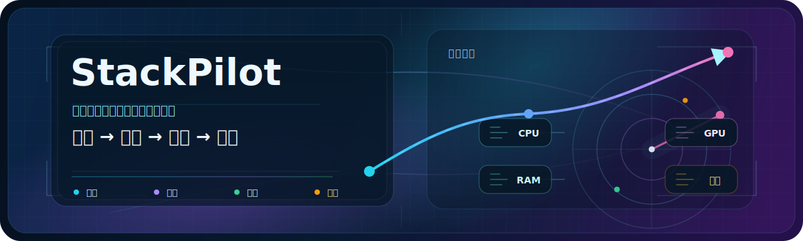
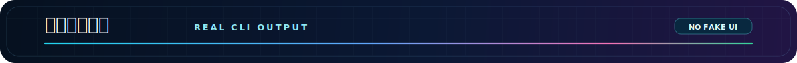
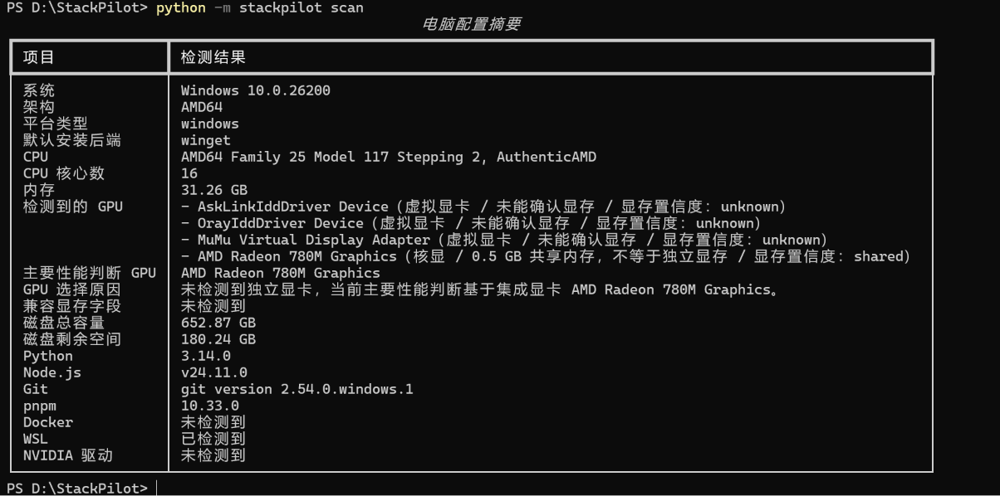
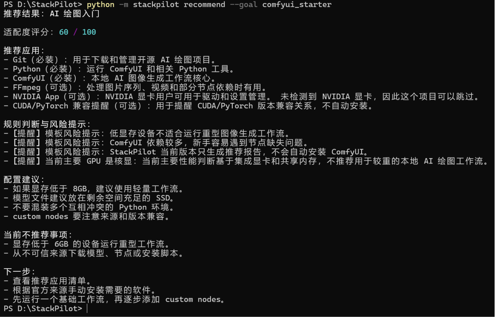
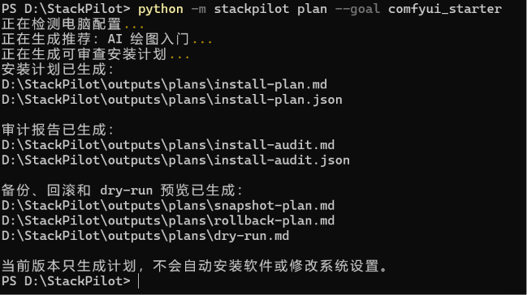
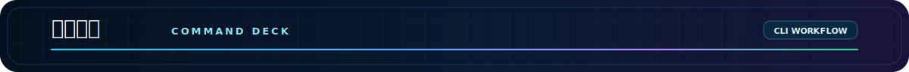

<div align="center">
  
  <h1>StackPilot</h1>
  <p><strong>不知道新电脑该装什么？先让 StackPilot 看看你的电脑。</strong></p>
  <p><strong>先看清楚，再决定怎么装。</strong></p>
  <p>StackPilot 是本地优先的电脑环境蓝图生成器。它先扫描公开硬件和已有环境，再生成应用推荐、风险提示和可审查安装计划。</p>
  <p>
    
    
    = 3.11" />
    
    
    
    
    
  </p>
  <p><sub>当前是 v0.5 Alpha CLI：不自动下载，不自动安装，不偷偷修改系统。</sub></p>
</div>

<p align="center">
  
</p>

很多电脑环境问题，不是从“该装哪个软件”开始的，而是从“不知道这台电脑现在是什么状态”开始的。

StackPilot 现在要做的事很直接：先把这台电脑看清楚，再给出一份能被人检查的推荐和计划。

<p align="center">
  
</p>

我做 StackPilot，是因为整理笔记本环境时被装机流程折腾过。

对熟悉电脑的人来说，装软件可能只是几条命令。对小白来说，问题会变成一串连锁反应：Python 版本要选哪个、CUDA 能不能装、Docker 和 WSL 是什么、驱动要不要更新、安装路径放哪里、C 盘空间够不够。

一些软件管家确实方便，但也可能遇到广告、弹窗、捆绑安装，或者推荐逻辑不透明的问题。去看教程又常常默认你已经懂 Python、Node、CUDA、Docker、WSL、驱动和路径这些东西。

所以 StackPilot 先不急着做自动安装。自动执行之前，至少应该先让每一步能被看见。

- 有些电脑没有独显，却照着高配 AI 绘图教程折腾；
- 有些工具会把缓存、模型或依赖塞进 C 盘；
- AI 绘图、本地模型、编程环境、游戏工具、内容创作工具混在一起时，很容易越装越乱；
- 小白真正缺的不是又一个安装脚本，而是一份先看清电脑状态后的推荐和计划。

StackPilot 当前强调的是透明、可审查、无广告、无捆绑、不偷偷改系统。它先看清电脑状态，再告诉你当前机器更适合装什么、哪里有风险、哪些步骤需要人工确认。

<p align="center">
  
</p>

> 它不是软件管家。
>
> 它是电脑环境蓝图生成器。

StackPilot 当前主要做四件事：

| 它会做什么           | 人话解释                                                              |
| -------------------- | --------------------------------------------------------------------- |
| 扫描本机状态         | 读取系统、CPU、内存、磁盘、GPU、Python、Git、Docker、WSL 等公开信息。 |
| 匹配目标模板         | 你说想做什么，它按模板给出应用建议和环境提示。                        |
| 生成可审查计划       | 输出 Markdown / JSON，让你先看，再决定是否手动执行。                  |
| 标记风险和不确定信息 | 比如虚拟显卡、共享显存、未知显存、路径和回滚限制。                    |

它不会自动安装软件，也不会替你修改系统。当前版本更像一个“先看清楚，再决定怎么装”的本地 CLI 工具。

几个英文词先翻译成人话：

| 术语           | 人话解释                                             |
| -------------- | ---------------------------------------------------- |
| Local-first    | 本地优先，优先在你的电脑上运行，不把报告上传到云端。 |
| dry-run        | 只预览会做什么，不实际执行。                         |
| Auditable Plan | 生成可以人工检查的安装计划。                         |
| GPU-aware      | 会尽量识别核显、独显、虚拟显卡和不确定显卡信息。     |
| Alpha CLI      | 早期命令行版本，还不是成熟桌面软件。                 |

## 适合谁

StackPilot 现在适合：

- 想整理新电脑环境，但不知道该装什么的人；
- 想体验 AI 绘图、本地 LLM、AI 编程工具的人；
- 想检查电脑有没有 Python、Git、Docker、WSL 等环境的人；
- 愿意用命令行测试早期版本的开发者、学生或折腾玩家。

暂时不太适合：

- 完全不想碰命令行的人；
- 想要一键自动安装所有软件的人；
- 想要成熟软件管家的用户。

如果你只想快速试一下，可以直接跑：

```powershell
python -m stackpilot doctor --goal comfyui_starter
```

这条命令只生成报告和计划，不会安装 ComfyUI 或其它软件。

## 15 秒 Demo

**我说它能跑，你可以先看视频再决定信不信。**

https://github.com/user-attachments/assets/5a50b36c-ec9f-494f-af9f-0c6ae95452f6

<p align="center">
  
</p>

| 硬件扫描                                                              | 推荐报告                                                                 | 可审查安装计划                                                              |
| --------------------------------------------------------------------- | ------------------------------------------------------------------------ | --------------------------------------------------------------------------- |
|  |  |  |
| 读取真实本机环境。                                                    | 生成推荐和风险提示。                                                     | 输出可人工审查的计划文本。                                                  |

<p align="center">
  
</p>

目标：3 分钟内在本机跑起来，先看到扫描和报告。

### 运行前准备

| 需要什么              | 用来做什么          | 怎么检查                  |
| --------------------- | ------------------- | ------------------------- |
| Python >= 3.11        | 运行 StackPilot CLI | `python --version`        |
| pip                   | 安装本地项目        | `python -m pip --version` |
| Git                   | 克隆仓库            | `git --version`           |
| PowerShell / Terminal | 执行命令            | Windows 推荐 PowerShell   |

Windows 用户如果还没有 Python，可以从 [Python 官网](https://www.python.org/downloads/) 安装。安装时建议勾选 `Add python.exe to PATH`，安装完成后重新打开 PowerShell。

检查 Python 和 pip：

```powershell
python --version
python -m pip --version
```

如果 `python` 不可用，可以试试：

```powershell
py --version
py -m pip --version
```

如果你的电脑只能用 `py`，后面的 `python -m ...` 可以替换成 `py -m ...`。

### Windows PowerShell

```powershell
git clone https://github.com/xaopengyo-1010/StackPilot.git
cd StackPilot
python -m pip install -e .
python -m stackpilot scan
python -m stackpilot doctor --goal comfyui_starter
```

### macOS / Linux

```bash
git clone https://github.com/xaopengyo-1010/StackPilot.git
cd StackPilot
python3 -m pip install -e .
python3 -m stackpilot scan
python3 -m stackpilot doctor --goal comfyui_starter
```

### 常用命令

| 命令                                                    | 作用                           |
| ------------------------------------------------------- | ------------------------------ |
| `python -m stackpilot scan`                             | 检测当前电脑配置和环境。       |
| `python -m stackpilot list-templates`                   | 查看支持的目标模板。           |
| `python -m stackpilot recommend --goal comfyui_starter` | 根据目标生成推荐结果。         |
| `python -m stackpilot plan --goal comfyui_starter`      | 生成可审查安装计划。           |
| `python -m stackpilot doctor --goal comfyui_starter`    | 一步完成检测、推荐和报告生成。 |


<p align="center">
  
</p>

| Template              | 适合谁             |
| --------------------- | ------------------ |
| `coding_starter`      | 写代码入门         |
| `vibe_coding`         | AI 辅助写代码      |
| `ai_beginner`         | AI 入门体验        |
| `comfyui_starter`     | AI 绘图入门        |
| `local_llm`           | 本地大模型环境规划 |
| `gaming_setup`        | 游戏玩家常用软件   |
| `creator_setup`       | 视频 / 内容创作    |
| `office_productivity` | 办公生产力         |

<p align="center">
  
</p>

如果你执行的是 `doctor`，推荐报告默认写到：

```text
outputs/reports/stackpilot-report.md
outputs/reports/stackpilot-report.json
```

如果你执行的是 `plan`，安装计划和审计材料默认写到：

```text
outputs/plans/install-plan.md
outputs/plans/install-plan.json
outputs/plans/install-audit.md
outputs/plans/install-audit.json
outputs/plans/snapshot-plan.md
outputs/plans/snapshot-plan.json
outputs/plans/rollback-plan.md
outputs/plans/rollback-plan.json
outputs/plans/dry-run.md
outputs/plans/dry-run.json
```

这些文件是给你打开阅读和审查的。StackPilot 当前不会自动执行里面的安装命令。

<p align="center">
  
</p>

StackPilot 当前宁愿慢一点，也不偷偷替你动系统。

它只生成报告、风险提示、dry-run 预览和可审查安装计划。它不会自动下载软件，不会执行安装命令，也不会直接修改你的系统。

| 当前版本会做         | 当前版本不会做                |
| -------------------- | ----------------------------- |
| 生成推荐报告         | 自动安装软件                  |
| 生成可审查安装计划   | 自动下载安装包                |
| 生成 dry-run 预览    | 执行 `winget install`         |
| 标记风险和不确定信息 | 修改 PATH / 环境变量 / 注册表 |
| 输出 Markdown / JSON | 自动回滚系统                  |
|                      | 删除用户文件                  |
|                      | 调用真实 LLM API              |
|                      | 承诺 100% 安全或 100% 回滚    |

StackPilot 的目标是降低风险，而不是假装风险不存在。如果某一步不确定，就应该把不确定写出来，而不是包装成“智能推荐”。

<p align="center">
  
</p>

### 这个项目是什么？

StackPilot 是本地电脑环境检测、应用推荐和可审查安装计划工具。它现在是早期命令行版本。

### 会自动安装吗？

不会。当前版本只生成报告、计划和 dry-run 预览，计划里的命令需要你自己阅读和判断。

### 没有独显能用吗？

可以。StackPilot 会尽量区分核显、独显、虚拟显卡和未知显卡。如果显存来源不确定，它会标记不确定，而不是假装知道。

### 推荐结果一定准确吗？

不保证。StackPilot 现在需要更多真实机器反馈。你可以把不合理的推荐、识别错误或文档看不懂的地方提到 Issue。

<p align="center">
  
</p>

安装开发依赖并运行测试：

```bash
python -m pip install -e ".[dev]"
python -m pytest
```

常用验证命令：

```bash
python -m stackpilot scan
python -m stackpilot list-templates
python -m stackpilot recommend --goal comfyui_starter
python -m stackpilot doctor --goal comfyui_starter
python -m stackpilot plan --goal comfyui_starter
```

<p align="center">
  
</p>

StackPilot 还是早期项目，现在最需要真实机器测试。

如果你愿意测试，最有价值的不是夸它，而是告诉我哪里识别错了。

| 反馈类型 | 什么最有帮助                                 |
| -------- | -------------------------------------------- |
| GPU      | 核显、独显、虚拟显卡、未知显卡是否识别合理。 |
| Python   | Python 版本、路径和 pip 检测是否准确。       |
| Git      | Git 是否识别正确，命令提示是否清楚。         |
| Docker   | Docker 是否存在，状态判断是否合理。          |
| WSL      | WSL 检测和提示是否能看懂。                   |
| 推荐结果 | 推荐是否合理，风险解释是否说清楚。           |

欢迎提交 Issue，把机器信息、命令输出、截图或你看不懂的地方说清楚就很有帮助。

- 反馈模板：[docs/feedback/feedback-template.md](docs/feedback/feedback-template.md)
- 真实机器测试记录：[docs/feedback/real-machine-tests.md](docs/feedback/real-machine-tests.md)

如果你觉得这个方向有价值，欢迎点一个 Star

## License

StackPilot 使用 [MIT License](LICENSE) 发布。
