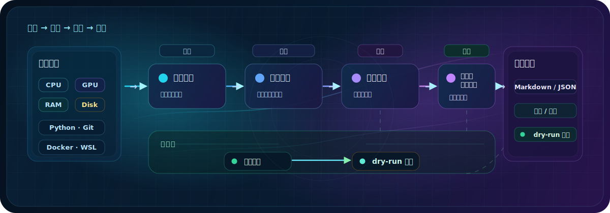

<div align="center">
  
  <h1>StackPilot</h1>
  <p><strong>本地优先的电脑环境推荐与规划助手。</strong></p>
  <p>先检测电脑配置，再生成应用推荐、风险提示和可审查安装计划。</p>
  <p>
    <code>v0.4.0-alpha</code> · <code>Python &gt;= 3.11</code> ·
    <code>MIT</code> · <code>Alpha CLI</code> · <code>Local-first</code>
  </p>
  <p>
    <code>dry-run</code> · <code>Auditable Plan</code> ·
    <code>GPU-aware</code> · <code>Markdown / JSON</code> ·
    <code>No auto install</code> · <code>Human review</code>
  </p>
  <p><strong>看得见每一步，装得明白，撤得回来。</strong></p>
  <p>
    <sub>这里的“撤”指计划、备份和回滚建议，不代表 StackPilot 会自动修改或自动回滚系统。</sub>
  </p>
</div>

<p align="center">
  
</p>

很多电脑环境问题，不是从“该装哪个软件”开始的，而是从“不知道这台电脑现在是什么状态”开始的。

我做 StackPilot，是因为之前给笔记本整理环境时发现：电脑对不太会折腾的人并不友好。哪怕只是装几个常用软件，也可能要找官网、看教程、分版本、选路径，还要担心广告、弹窗、捆绑安装和 C 盘空间。

StackPilot 想做的不是另一个软件管家，也不是一键帮你乱装东西。它现在更像一份本地电脑环境体检 + 推荐清单：先读取本机公开硬件和环境信息，再根据你的目标生成推荐报告、风险提示和可审查安装计划。

## 先说清楚：它到底干什么？

StackPilot 现在主要做四件事：

1. 扫描：读取当前电脑的系统、CPU、内存、磁盘、GPU 和常用开发环境；
2. 推荐：根据目标模板生成应用推荐和风险提示；
3. 计划：输出可人工审查的安装计划；
4. 审计：标记不确定信息，比如虚拟显卡、共享显存、未知显存。

它不会自动安装软件，也不会替你修改系统。当前版本更像一个“先看清楚，再决定怎么装”的本地 CLI 工具。

**15 秒看看它怎么跑：**

https://github.com/user-attachments/assets/5a50b36c-ec9f-494f-af9f-0c6ae95452f6

<a id="quickstart"></a>

<p align="center">
  
</p>

### 运行前准备

| 需要什么              | 用来做什么          | 怎么检查                  |
| --------------------- | ------------------- | ------------------------- |
| Python >= 3.11        | 运行 StackPilot CLI | `python --version`        |
| pip                   | 安装本地项目        | `python -m pip --version` |
| Git                   | 克隆仓库            | `git --version`           |
| PowerShell / Terminal | 执行命令            | Windows 推荐 PowerShell   |

### 如果你还没有 Python

Windows 用户可以从 [Python 官网](https://www.python.org/downloads/) 安装 Python。安装时建议勾选 `Add python.exe to PATH`，安装完成后重新打开 PowerShell。

检查 Python 和 pip：

```powershell
python --version
python -m pip --version
```

如果 `python` 不可用，可以试试：

```powershell
py --version
py -m pip --version
```

如果你的电脑只能用 `py`，后面的 `python -m ...` 可以替换成 `py -m ...`。

### 第一次怎么跑？

Windows PowerShell：

```powershell
# 1. 克隆项目
git clone https://github.com/xaopengyo-1010/StackPilot.git

# 2. 进入项目目录
cd StackPilot

# 3. 安装当前项目到本地 Python 环境
python -m pip install -e .

# 4. 检测当前电脑配置
python -m stackpilot scan

# 5. 一步生成推荐报告
python -m stackpilot doctor --goal comfyui_starter
```

macOS / Linux：

```bash
git clone https://github.com/xaopengyo-1010/StackPilot.git
cd StackPilot
python3 -m pip install -e .
python3 -m stackpilot scan
python3 -m stackpilot doctor --goal comfyui_starter
```

### 命令是什么意思？

| 命令                                                    | 作用                           |
| ------------------------------------------------------- | ------------------------------ |
| `python -m stackpilot scan`                             | 检测当前电脑配置和环境。       |
| `python -m stackpilot list-templates`                   | 查看支持的目标模板。           |
| `python -m stackpilot recommend --goal comfyui_starter` | 根据目标生成推荐结果。         |
| `python -m stackpilot plan --goal comfyui_starter`      | 生成可审查安装计划。           |
| `python -m stackpilot doctor --goal comfyui_starter`    | 一步完成检测、推荐和报告生成。 |

### 第一次建议用哪个 goal？

如果只是想快速测试，我建议先用：

```powershell
python -m stackpilot doctor --goal comfyui_starter
```

`comfyui_starter` 比较适合首次测试，因为它能明显看出硬件 / GPU 判断、推荐报告和风险提示。如果你不是 AI 绘图用户，也可以试：

- `coding_starter`
- `vibe_coding`
- `local_llm`

这些命令都只是生成报告和计划，不会自动安装对应工具。

<a id="why"></a>

<p align="center">
  
</p>

我最开始想做 StackPilot，是因为整理笔记本环境时被装机流程折腾过。

对熟悉电脑的人来说，装软件可能只是几条命令。对小白来说，问题会变成一串连锁反应：Python 版本要选哪个、CUDA 能不能装、Docker 和 WSL 是什么、驱动要不要更新、安装路径放哪里、C 盘空间够不够。

一些软件管家确实方便，但也可能遇到广告、弹窗、捆绑安装，或者推荐逻辑不透明的问题。去看教程又常常默认你已经懂 Python、Node、CUDA、Docker、WSL、驱动和路径这些东西。

所以 StackPilot 先不急着做自动安装。自动执行之前，至少应该先让每一步能被看见。

- 有些电脑没有独显，却照着高配 AI 绘图教程折腾；
- 有些工具会把缓存、模型或依赖塞进 C 盘；
- AI 绘图、本地模型、编程环境、游戏工具、内容创作工具混在一起时，很容易越装越乱；
- 小白真正缺的不是又一个安装脚本，而是一份先看清电脑状态后的推荐和计划。

StackPilot 当前强调的是透明、可审查、无广告、无捆绑、不偷偷改系统。它先看清电脑状态，再告诉你当前机器更适合装什么、哪里有风险、哪些步骤需要人工确认。

<a id="workflow"></a>

<p align="center">
  
</p>



```text
扫描电脑 → 匹配目标模板 → 生成推荐报告 → 输出可审查安装计划 → 标记风险和不确定信息
```

<a id="preview"></a>

<p align="center">
  
</p>

| 硬件扫描                                                              | 推荐报告                                                                 | 可审查安装计划                                                              |
| --------------------------------------------------------------------- | ------------------------------------------------------------------------ | --------------------------------------------------------------------------- |
|  |  |  |
| 读取真实本机环境。                                                    | 生成推荐和风险提示。                                                     | 输出可人工审查的计划文本。                                                  |

<a id="capabilities"></a>

<p align="center">
  
</p>

| 阶段      | 能力           | StackPilot 做什么                                                 |
| --------- | -------------- | ----------------------------------------------------------------- |
| Scan      | 硬件与环境扫描 | 读取系统、CPU、内存、磁盘、GPU、Python、Git、Docker、WSL 等状态。 |
| Recommend | 规则推荐       | 基于目标模板生成应用推荐、适配评分和风险提示。                    |
| Plan      | 可审查安装计划 | 输出安装计划、审计报告、备份 / 回滚计划和 dry-run 预览。          |
| Audit     | 风险与不确定性 | 标记虚拟显卡、共享显存、未知显存等不确定信息。                    |

<a id="release"></a>

<p align="center">
  
</p>

### v0.4.0-alpha · GPU Radar Upgrade

v0.4 增强了 GPU 检测链路，可以区分核显、独显、虚拟显卡和未知显卡。

| Upgrade              | Meaning                                   |
| -------------------- | ----------------------------------------- |
| GPU list             | 保留完整 GPU 列表，避免只看单一显卡名称。 |
| primary_gpu          | 标记主要性能判断 GPU。                    |
| gpu_selection_reason | 解释为什么这样判断。                      |
| vram_confidence      | 标记显存可信度。                          |
| shared / unknown     | 不把共享内存伪装成独立显存。              |

它不会承诺显存识别 100% 准确。如果无法确认显存来源，就明确告诉你不确定，而不是假装知道。


<a id="templates"></a>

<p align="center">
  
</p>

| Template              | 适合谁             |
| --------------------- | ------------------ |
| `coding_starter`      | 写代码入门         |
| `vibe_coding`         | AI 辅助写代码      |
| `ai_beginner`         | AI 入门体验        |
| `comfyui_starter`     | AI 绘图入门        |
| `local_llm`           | 本地大模型环境规划 |
| `gaming_setup`        | 游戏玩家常用软件   |
| `creator_setup`       | 视频 / 内容创作    |
| `office_productivity` | 办公生产力         |

<a id="outputs"></a>

<p align="center">
  
</p>

如果你执行的是 `doctor`，推荐报告默认写到：

```text
outputs/reports/stackpilot-report.md
outputs/reports/stackpilot-report.json
```

如果你执行的是 `plan`，安装计划和审计材料默认写到：

```text
outputs/plans/install-plan.md
outputs/plans/install-plan.json
outputs/plans/install-audit.md
outputs/plans/install-audit.json
outputs/plans/snapshot-plan.md
outputs/plans/snapshot-plan.json
outputs/plans/rollback-plan.md
outputs/plans/rollback-plan.json
outputs/plans/dry-run.md
outputs/plans/dry-run.json
```

这些文件是给你打开阅读和审查的。StackPilot 当前不会自动执行里面的安装命令。

<a id="safety"></a>

<p align="center">
  
</p>

我现在没有急着做自动安装，原因很简单：自动执行之前，先要让每一步能被看见。

StackPilot 当前只生成报告、计划和 dry-run 预览，不会自动安装软件，也不会直接修改系统。这样做可能慢一点，但更适合早期版本，也更适合让用户和贡献者一起检查推荐逻辑。

> [!IMPORTANT]
> 当前版本只生成报告、计划和 dry-run 预览，不会自动安装软件，也不会直接修改系统。

| 当前版本会做            | 当前版本不会做                     |
| ----------------------- | ---------------------------------- |
| 生成推荐报告            | 自动安装软件                       |
| 生成可审查安装计划      | 自动下载安装包                     |
| 生成安装审计说明        | 执行 `winget install`              |
| 生成 dry-run 预览       | 执行安装脚本或 PowerShell 安装脚本 |
| 生成备份 / 回滚计划文档 | 修改 PATH / 环境变量 / 注册表      |
| 标记风险和不确定信息    | 自动创建真实系统还原点             |
| 保持本地 CLI 工作流     | 自动回滚系统或删除用户文件         |
| 输出 Markdown / JSON    | 调用真实 LLM API                   |
| 给出可人工审查的计划    | 承诺 100% 安全或 100% 回滚         |

StackPilot 的目标是降低风险，而不是假装风险不存在。如果某一步不确定，就应该把不确定写出来，而不是包装成“智能推荐”。

<a id="faq"></a>

<p align="center">
  
</p>

### StackPilot 会自动安装软件吗？

不会。当前版本只生成报告、计划和 dry-run 预览，计划里的命令需要你自己阅读和判断。

### 没有独显还能用吗？

可以。StackPilot 会尽量区分核显、独显、虚拟显卡和未知显卡。如果显存来源不确定，它会标记不确定，而不是假装知道。

### 推荐结果一定正确吗？

不保证。StackPilot 现在是早期版本，推荐逻辑还需要更多真实机器反馈。你可以把不合理的推荐、识别错误或文档看不懂的地方提到 Issue。

<a id="dev"></a>

<p align="center">
  
</p>

安装开发依赖并运行测试：

```bash
python -m pip install -e ".[dev]"
python -m pytest
```

常用验证命令：

```bash
python -m stackpilot scan
python -m stackpilot list-templates
python -m stackpilot recommend --goal comfyui_starter
python -m stackpilot doctor --goal comfyui_starter
python -m stackpilot plan --goal comfyui_starter
```

<a id="feedback"></a>

<p align="center">
  
</p>

StackPilot 还是早期项目，最需要真实机器测试。尤其欢迎你拿自己的电脑跑一下，看看检测结果、推荐结果和命令输出是否正常。

| 反馈类型       | 什么最有帮助                                         |
| -------------- | ---------------------------------------------------- |
| Hardware       | GPU / 核显 / 独显 / 虚拟显卡识别是否准确。           |
| Environment    | Python / Git / Docker / WSL 环境检测是否准确。       |
| Recommendation | 推荐结果是否离谱，解释是否看得懂。                   |
| Install Plan   | 安装计划是否清楚，来源、风险或回滚信息是否需要补充。 |
| Docs           | README 是否能看懂，命令是否能跑起来。                |
| Template       | 新模板、规则或文档建议。                             |

欢迎提交 Issue。如果你觉得 StackPilot 有用，也欢迎点一个 Star。Star 是我继续更新它的最大动力。

## 许可证

StackPilot 使用 [MIT License](LICENSE) 发布。
